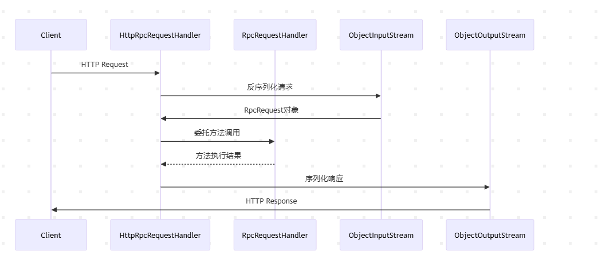

# rpc-server
server模块中共有6个文件包，分别对应6个模块
## annotation

### RpcComponentScan
定义了一个名为 RpcComponentScan 的自定义注解，用于在 Spring 框架中实现RPC组件的扫描和注册。
注解元信息
@Target(ElementType.TYPE) 表示该注解只能作用于类、接口或枚举类型。
@Retention(RetentionPolicy.RUNTIME) 表示注解在运行时保留，可通过反射机制读取。
@Documented 将注解包含在 Javadoc 中。
@Inherited 允许子类继承父类上的该注解
@Import(RpcBeanDefinitionRegistrar.class) 这是关键部分，通过 Spring 的 @Import 机制引入 RpcBeanDefinitionRegistrar 类。该类实现了 ImportBeanDefinitionRegistrar 接口，允许在 Spring 容器启动时动态注册 Bean 定义。
RpcBeanDefinitionRegistrar 的作用 Spring 会在解析该注解时调用 registerBeanDefinitions 方法，将 RpcComponentScan 注解的元数据（如包路径）和容器注册器传递给该方法。通过这种方式，实现自定义的组件扫描逻辑。
value() 和 basePackages() 这两个属性通过 @AliasFor 互相声明为别名，允许用户以两种等效方式指定扫描包路径：
@RpcComponentScan("com.example.package")
@RpcComponentScan(basePackages = "com.example.package")
作用 定义需要扫描 RPC 组件的包路径。开发者可以通过这些属性指定哪些包下的类需要被扫描并注册为 RPC 服务。
### RpcService
RpcService 的自定义 Java 注解，用于标记 RPC（远程过程调用）服务的实现类
## config
### RpcServerAutoConfiguration
Spring Boot 的自动配置类，用于自动装配 RPC 服务器端相关组件
@Configuration 表示这是一个 Spring 配置类，定义 Bean 的创建和依赖关系。
@EnableConfigurationProperties(RpcServerProperties.class) 启用 RpcServerProperties 类作为配置属性绑定，允许从 application.yml 或 application.properties 中读取以 rpc.server 开头的配置项。
自动配置流程：
根据配置选择服务注册中心（默认 ZooKeeper）。
根据配置选择传输协议（默认 Netty）。
创建后处理器，将服务注册并暴露。
扩展性：
可通过配置文件application.properties覆盖默认行为。
支持多种传输协议，方便切换（Netty/HTTP/Socket）。
条件化装配：
使用 @ConditionalOnXXX 系列注解，确保只在满足条件时创建 Bean，避免冲突
### RpcServerProperties
用于配置RPC服务器的属性类，主要功能是集中管理RPC服务端的配置参数。
配置属性映射：通过 @ConfigurationProperties 注解将配置文件application.properties中以 rpc.server 为前缀的配置项自动映射到该类的属性上。
默认值管理：为每个配置属性提供合理的默认值，避免用户必须手动配置所有参数。
集中管理：统一管理RPC服务端相关的配置（如端口、注册中心地址、传输协议等），提升代码可维护性。
## handler
### RpcRequestHandler
用于处理RPC（远程过程调用）请求的核心处理器，它通过反射机制调用本地服务的方法并返回结果。
接收请求：获取客户端发送的 RpcRequest，包含服务名、方法名、参数类型和参数值。
查找服务：从本地缓存中根据服务名获取对应的服务实例。
验证服务：若服务不存在，立即终止并抛出异常。
反射调用：通过反射找到目标方法并执行，返回结果。
## spring
### RpcBeanDefinitionRegistrar
自动扫描并注册带有 @RpcService 注解的类到 Spring 容器,通过 @RpcComponentScan 注解配置的包路径，扫描并注册所有标记了 @RpcService 的类为 Spring Bean。
### RpcClassPathBeanDefinitionScanner
RPC服务注册：通过自定义注解（如@RpcService）标记需要暴露的服务实现类，扫描后自动注册为Spring Bean。
### RpcServerBeanPostProcessor
用于Spring Boot应用的RPC服务器处理器，主要实现了服务注册、RPC服务器启动和优雅关闭的功能
扩展性设计：
通过ServiceRegistry接口支持不同注册中心实现
配置驱动（RpcServerProperties）方便环境适配
容错机制：
异常处理包装为RpcException
详细的错误日志记录
版本默认值处理
生命周期管理：
Bean初始化阶段的服务注册
应用启动时的服务器启动
应用关闭时的资源清理
代理兼容：
使用AopUtils处理AOP代理类
确保注解扫描的准确性
## store
### LocalServiceCache
ConcurrentHashMap实现本地服务缓存
## transport
### RpcServer
公共接口
### http
#### DispatcherServlet：
单例处理器：
通过SingletonFactory获取HttpRpcRequestHandler实例，确保处理器全局唯一
暗示请求处理类需要设计为无状态或线程安全
异步处理机制：
将请求处理任务提交到线程池（threadPool.submit）
实现请求处理线程与Servlet容器的IO线程分离，避免阻塞
提升服务器吞吐量和并发处理能力
#### HttpRpcRequestHandler

#### HttpRpcServer
基于HTTP协议的嵌入式RPC服务器，使用Apache Tomcat作为内嵌的Web容器。
### netty
#### NettyRpcRequestHandler
基于 Netty 实现的 RPC 请求处理器，负责处理客户端发送的 RPC 请求和心跳检测
继承关系 继承 SimpleChannelInboundHandler<RpcMessage>，表示这是一个 Netty 的入站处理器，专门处理 RpcMessage 类型的消息。
线程池 使用 ThreadPoolExecutor 异步处理请求，避免阻塞 Netty 的 I/O 线程，提升吞吐量。
单例请求处理器 通过 SingletonFactory 获取 RpcRequestHandler 单例，用于实际执行 RPC 方法调用。
#### NettyRpcServer
Reactor 线程模型：Boss-Worker 多线程模型提升并发性能。
可扩展编解码器：SharableRpcMessageCodec 支持多种序列化协议。
空闲检测：自动清理无效连接，节省资源。
优雅停机：确保所有任务完成后再关闭线程。
### socket
#### SocketRpcRequestHandler
实现接口：Runnable，每个请求会在独立线程中处理。
作用：接收Socket连接，解析客户端发送的RPC请求，调用目标服务方法，并通过Socket返回响应结果。
实现了基于Socket的RPC服务端请求处理器，负责接收请求、调用服务方法，并返回响应。通过多线程处理保障并发性能，结合异常封装和日志记录确保健壮性
#### SocketRpcServer
基于Socket实现的RPC服务器
